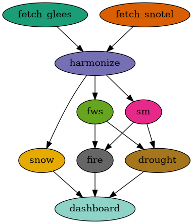

# Drought Workflow — Pegasus WMS (SNOTEL + GLEES + SAGE)

A Pegasus workflow that turns co-located forest observations — **SNOTEL #367**
(snow/SWE/precip), **GLEES / AmeriFlux US-GLE** (flux/soil), and optional **SAGE /
Waggle edge sensors** — into five drought-related decision layers for a subalpine
forest watershed:

1. **Soil moisture map**
2. **Forest water stress map**
3. **Snowmelt recharge timing**
4. **Drought warning**
5. **Wildfire risk**

The reference domain is the **Snowy Range, Medicine Bow National Forest, WY** —
the GLEES Brooklyn Tower (US-GLE, 41.3665 °N, −106.2399 °W, 3197 m, subalpine
spruce-fir). Re-target it by editing `region_config.json`.

## Workflow Architecture



```
fetch_sage   ─┐
fetch_glees  ─┼─> harmonize ─┬─> soil_moisture_map ──┐
fetch_snotel ─┘              ├─> forest_water_stress ┼─> wildfire_risk ──┐
                             │        └──────────────┴─> drought_warning ┼─> dashboard
                             └─> snowmelt_recharge ─────────────────────-┘
```

- **Fetch** jobs pull from each source and normalise everything onto one
  long-format schema: `timestamp, source, node, lat, lon, variable, value, unit`.
- **`harmonize`** merges all sources into one analysis-ready `observations.csv`
  (one canonical unit per variable, deduped, with a provenance report). It is the
  single input to every layer, so adding/removing a source needs no layer change.
- **Layer** jobs each read the harmonized observations and emit a JSON layer.
- `drought_warning` and `wildfire_risk` are composites — they also consume the
  soil-moisture and forest-water-stress layers.
- `dashboard` renders all five layers into one PNG (maps + timelines + summary).

> **No Thor Blade?** The GLEES Sage edge node ("Thor Blade") isn't required. The
> live path uses **SNOTEL #367** (co-located with GLEES, public) + AmeriFlux; the
> Sage fetcher stays dormant until you add a node VSN to `region_config.json`. See
> `SPEC.md` §3–4 for the full Sage/GLEES architecture and the no-blade strategy.

## Data Sources

### SNOTEL #367 — Brooklyn Lake (primary live source)

NRCS SNOTEL station **Brooklyn Lake (367:WY:SNTL)** sits ~1 km from the GLEES
tower (41.367 °N, −106.233 °W). Fully public, no auth, via the AWDB REST API:

```
GET https://wcc.sc.egov.usda.gov/awdbRestApi/services/v1/data
    ?stationTriplets=367:WY:SNTL&elements=WTEQ,SNWD,PREC,TOBS&duration=DAILY
    &beginDate=2023-05-01&endDate=2023-10-01
```

`fetch_snotel_data.py` maps element codes to the common schema and converts
imperial → metric: `WTEQ→swe`, `SNWD→snow_depth`, `PRCP→precip`,
`TOBS/TAVG→air_temp`, `SMS→soil_moisture`, `STO→soil_temp`. (#367 is a basic
snow-pillow site, so it supplies snow/SWE/precip/air-temp; **soil moisture comes
from GLEES** — which is exactly why `harmonize` merges multiple sources.)

### SAGE / Waggle (edge sensors)

Anonymous public query API — no key required:

```
POST https://data.sagecontinuum.org/api/v1/query
{"start": "2023-05-01", "end": "2023-10-01", "filter": {"name": "env.temperature", "vsn": "W097"}}
```

`fetch_sage_data.py` queries the measurement names in `region_config.json` **for
the configured node VSNs only**. If no nodes are configured it skips the query
(an unscoped network-wide pull is intentionally not allowed) and the workflow
falls back to GLEES. Add nodes like so:

```json
"sage": { "nodes": [ { "vsn": "W097", "lat": 41.37, "lon": -106.24 } ] }
```

### GLEES / AmeriFlux US-GLE (flux tower)

AmeriFlux data are **not** anonymously downloadable — a free account and
acceptance of the CC-BY-4.0 policy are required. `fetch_glees_data.py` uses the
official AmeriFlux download service with credentials from the environment:

```sh
export AMERIFLUX_USER_ID="your_username"
export AMERIFLUX_USER_EMAIL="you@example.org"   # register at ameriflux.lbl.gov
```

Or skip the credentialed download and pass a BASE file you fetched by hand:

```sh
python workflow_generator.py --glees-base-csv AMF_US-GLE_BASE_HH_20-5.csv -o workflow.yml
```

The fetcher parses the half-hourly **BASE** product and maps FP-standard columns
(`TA, RH, WS, PA, P, LE, H, NETRAD, SWC, TS, D_SNOW, VPD`) onto the common schema
(`-9999` → missing; SWC % → fraction; cm snow → m; kPa → Pa).

BASE DOI: `10.17190/AMF/1246056`.

## The Layers

| Layer | Script | Key inputs | Output |
|-------|--------|-----------|--------|
| Soil moisture map | `bin/soil_moisture_map.py` | SWC | per-site value + dryness class, IDW grid |
| Forest water stress | `bin/forest_water_stress.py` | LE/H, VPD, SWC | FWSI 0–1, class |
| Snowmelt recharge | `bin/snowmelt_recharge.py` | D_SNOW, TS, SWC | peak / snow-free / thaw / recharge dates + lag |
| Drought warning | `bin/drought_warning.py` | layers 1–2, P, VPD | DSI 0–1, USDM-style category (D0–D4) |
| Wildfire risk | `bin/wildfire_risk.py` | TA, RH, WS + layers 1–2 | fuel-adjusted Fosberg FFWI, class |

Index definitions:

- **FWSI** = `0.40·(1−EF) + 0.35·norm(VPD) + 0.25·(1−norm(SM))`, where
  `EF = LE/(LE+H)` (daytime). Terms re-weight at nodes lacking flux data.
- **DSI** = `0.35·(1−SM_percentile) + 0.25·FWSI + 0.20·precip_deficit + 0.20·norm(VPD)`,
  mapped to None / D0 / D1 / D2 / D3 / D4 with a warning level
  (normal → watch → warning → emergency).
- **Wildfire** = Fosberg FFWI (temperature, RH via fine-fuel equilibrium
  moisture, wind) `× (0.6 + 0.4·fuel_dryness)`, fuel dryness from soil moisture
  and forest water stress.

## Running the Workflow

### Prerequisites

- **Pegasus WMS ≥ 5.0** and **HTCondor** on the submit host (`pegasus-plan`,
  `pegasus-status`, `condor_q` on the `PATH`).
- **Singularity/Apptainer** on the execution nodes — the transformation catalog
  runs every job inside `docker://kthare10/drought:latest` (pulled and converted
  automatically). No local Python deps are needed on the execution side.
- **Python 3.11** on the submit host, only to run `workflow_generator.py`.
- **AmeriFlux credentials** for the GLEES flux data (free), or a
  pre-downloaded BASE CSV — see *GLEES / AmeriFlux* under Data Sources.

### 1. Set up the generator environment

```sh
python3 -m venv .venv && source .venv/bin/activate
pip install -r requirements.txt
```

### 2. (Optional) provide GLEES credentials

The `fetch_glees_data` job needs AmeriFlux access. Export credentials so they
never live in the workflow:

```sh
export AMERIFLUX_USER_ID="your_username"
export AMERIFLUX_USER_EMAIL="you@example.org"   # register at ameriflux.lbl.gov
```

…or skip the credentialed download by passing a BASE file you fetched by hand
(`--glees-base-csv`, see step 3). Either way SNOTEL #367 supplies the live
snow/SWE/precip data with no auth.

### 3. Generate the DAG

```sh
python workflow_generator.py --config region_config.json -o workflow.yml
```

Generator options:

| Flag | Default | Purpose |
|------|---------|---------|
| `--config` | `region_config.json` | Region/sensor configuration JSON |
| `--sources` | `sage glees snotel` | Which sources to fetch. Pass a subset to include only those fetch jobs |
| `--start-date` / `--end-date` | from config `date_range` | Override the fetch window (`YYYY-MM-DD`) |
| `--glees-base-csv` | — | Use a pre-downloaded AmeriFlux BASE CSV instead of the credentialed download |
| `-e`, `--execution-site-name` | `condorpool` | HTCondor pool the jobs run on |
| `--container-image` | `kthare10/drought:latest` | Docker image backing every job |
| `-o`, `--output` | `workflow.yml` | Output workflow file |

**Running with only some sources.** By default all three fetchers run and
`harmonize` merges whatever they return. To start small — or to avoid the
AmeriFlux credentials GLEES needs — generate the DAG with just the sources you
want. Only the selected fetch jobs are created and wired into `harmonize`; the
layers and dashboard are unchanged:

```sh
# SNOTEL only — fully public, no credentials, good first test
python workflow_generator.py --config region_config.json --sources snotel -o workflow.yml

# SNOTEL + GLEES (needs AmeriFlux creds or --glees-base-csv)
python workflow_generator.py --config region_config.json --sources snotel glees -o workflow.yml
```

A SNOTEL-only run supplies snow/SWE/precip/air-temp but no flux or soil-moisture
data, so the forest-water-stress and soil-moisture layers fall back to their
reduced-input behavior — expect thinner layers until you add GLEES.

The generator also writes the sites, replica, and transformation catalogs and a
`pegasus.properties` file next to `workflow.yml`.

### 4. Plan, submit, and monitor

```sh
pegasus-plan --submit -s condorpool -o local workflow.yml
pegasus-status -w <submit_dir>          # poll progress
pegasus-analyzer <submit_dir>           # debug any failed jobs
```

`-o local` stages the final layer JSONs and `drought_dashboard.png` back to the
`output/` directory (the `local` site's `LOCAL_STORAGE`). On success you'll find
the five layer JSONs and the dashboard PNG there — see *Outputs* below.

### Local smoke test (no Pegasus)

To run every step by hand — useful for validating a config change or new region
before submitting — see `example_usage.sh`, which chains the fetch → harmonize →
layer → dashboard scripts directly against `output/`.

## Configuration (`region_config.json`)

| Key | Meaning |
|-----|---------|
| `bbox` | Map extent + Sage node spatial filter |
| `date_range` | Default fetch window (overridable with `--start-date/--end-date`) |
| `glees` | US-GLE site id and coordinates |
| `sage.nodes` | Waggle VSNs with lat/lon (empty → GLEES-only) |
| `sage.measurements` | Sage measurement names → normalised variables |

## Container

```sh
docker build -t kthare10/drought:latest -f Docker/Drought_Dockerfile .
docker push kthare10/drought:latest
```

## Outputs

A run writes the five layer JSONs and `drought_dashboard.png` to `output/`
(the `local` site's `LOCAL_STORAGE`). That directory is git-ignored — it holds
generated artifacts, not source — so it is created on first run.

## License

Licensed under the Apache License, Version 2.0. See [`LICENSE`](LICENSE).
